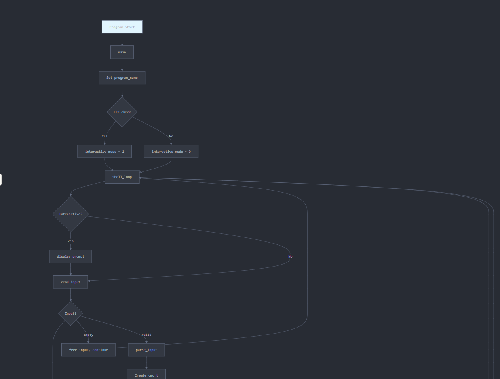
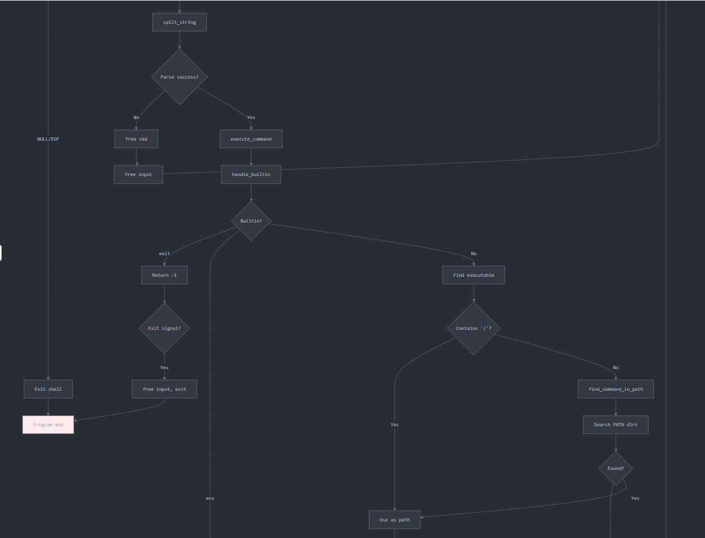
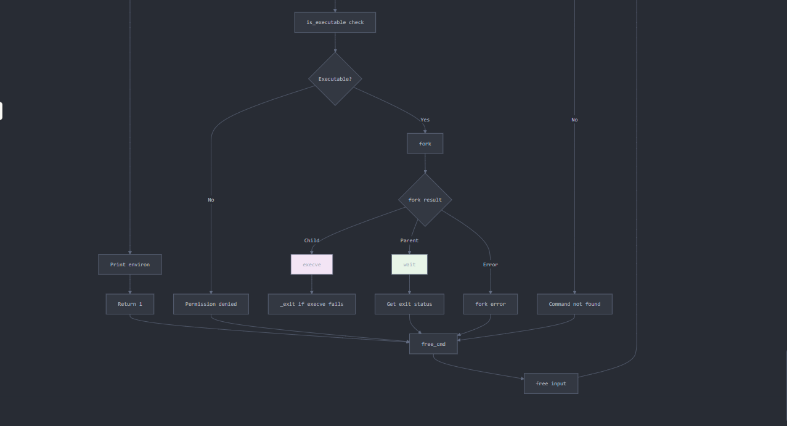

# HSH Simple Shell - Code Documentation

## Overview
This is a simple UNIX command interpreter implementation that provides basic shell functionality. The shell can execute commands, resolve paths, handle built-in commands, and manage processes using the fork-exec model. It operates in both interactive and non-interactive modes.

## Code Structure
The implementation consists of 15 main functions organized in a modular design:
```c
main()
└── shell_loop()
    ├── display_prompt()
    ├── read_input()
    ├── parse_input()
    │   └── split_string()
    └── execute_command()
        ├── handle_builtin()
        │   ├── builtin_exit()
        │   └── builtin_env()
        ├── find_command_in_path()
        │   └── find_path_in_environ()
        ├── is_executable()
        └── Memory Management
            ├── free_cmd()
            ├── free_array()
            └── count_args()
```
## Function Documentation

### 1. `main(int argc, char *argv[])`
**Entry point** - Initializes shell and determines operating mode
**Parameters:**
- `argc`: Argument count (unused)
- `argv`: Argument vector (program name used for error messages)

**Return:** Always 0

**Key Operations:**
- Sets global program name
- Detects interactive mode using `isatty(STDIN_FILENO)`
- Launches main shell loop

### 2. `shell_loop(char *program_name)`
**Main execution loop** - Handles command processing cycle
**Parameters:**
- `program_name`: Shell program name for error messages

**Core Loop Logic:**
1. Display prompt (interactive mode only)
2. Read user input
3. Parse input into command structure
4. Execute command
5. Handle exit conditions and memory cleanup

**Exit Conditions:**
- EOF (Ctrl+D)
- `exit` built-in command
- Command not found in non-interactive mode

### 3. `read_input(void)`
**Input handler** - Reads and processes user input
**Return:** Allocated string containing user input, or NULL on EOF

**Algorithm:**
1. Use `getline()` to read complete line
2. Handle EOF gracefully
3. Strip trailing newline character
4. Return dynamically allocated string

**Memory Management:** Caller must free returned string

### 4. `parse_input(char *input)`
**Command parser** - Converts input string to command structure
**Parameters:**
- `input`: Raw input string from user

**Return:** Pointer to `cmd_t` structure, or NULL on error

**Parsing Process:**
1. Skip leading whitespace
2. Split input into tokens using `split_string()`
3. Set command name from first token
4. Count total arguments
5. Return populated command structure

### 5. `split_string(char *str, char *delim)`
**Tokenizer** - Splits string into array of tokens
**Parameters:**
- `str`: String to split
- `delim`: Delimiter characters (space and tab)

**Return:** NULL-terminated array of string tokens

**Algorithm:**
1. Allocate array for `MAX_ARGS` pointers
2. Create working copy of input string
3. Use `strtok()` to extract tokens
4. Create separate copies of each token with `strdup()`
5. NULL-terminate the array

### 6. `execute_command(cmd_t *cmd, char *program_name)`
**Command executor** - Main command execution logic
**Parameters:**
- `cmd`: Parsed command structure
- `program_name`: Shell name for error messages

**Return:** Command exit status or -1 for errors

**Execution Flow:**
1. Check for built-in commands first
2. Resolve command path (absolute/relative vs PATH search)
3. Verify file exists and is executable
4. Fork child process
5. Child: Execute program with `execve()`
6. Parent: Wait for child completion and return exit status

### 7. `handle_builtin(cmd_t *cmd)`
**Built-in disppatcher** - Checks and executes built-in commands
**Parameters:**
- `cmd`: Command structure

**Return:** 1 if built-in handled, 0 if not built-in, -1 for exit

**Supported Built-ins:**
- `exit`: Signals shell termination
- `env`: Prints environment variables

### 8. `find_command_in_path(char *command)`
**Path resolver** - Locates executable in PATH directories
**Parameters:**
- `command`: Command name to locate

**Return:** Full path to executable, or NULL if not found

**Algorithm:**
1. Get PATH from environment using `find_path_in_environ()`
2. Split PATH by colons using `strtok()`
3. For each directory, construct full path
4. Check if path is executable using `is_executable()`
5. Return first match found

### 9. `find_path_in_environ(void)`
**Environment scanner** - Finds PATH variable in environ array
**Return:** Pointer to PATH value, or NULL if not found

**Implementation:**
- Iterates through global `environ` array
- Uses `strncmp()` to match "PATH=" prefix
- Returns pointer pst "PATH=" to actual value

### 10. `is_executable(char *path)`
**File validator** - Checks if file exists and is executable
**Parameters:**
- `path`: File path to check

**Return:** 1 if executable, 0 otherwise

**Validation Process:**
1. Use `stat()` to get file information
2. Verify file exists (stat succeeds)
3. Confirm it's a regular file with `S_ISREG()`
4. Check owner execute permission with `S_ICUSR`

## Memory Management Functions

### 11. `free_cmd(cmd_t *cmd)`
**Command cleanup** - Frees all memory associated with command structure
**Algorithm:**
1. Free command name string
2. Free argument array using `free_array()`
3. Free command structure itself

### 12. `free_array(char **array)`
**Array cleanup** - Frees NULL-terminated array of strings
**Algorithm:**
1. Iterate through array until NULL
2. Free each individual string
3. Free array structure

### 13. `count_args(char **args)`
**Utility function** - Counts arguments in NULL terminated array
**Return:** Number of arguments (excluding NULL terminator)

## Data structures

### `cmd_t` Structure
```c
typedef struct {
    char *command;      // Command name
    char **args;        // NULL-terminated argument array
    int arg_count;      // Number of arguments
} cmd_t;
```

## Usage Examples

### Interactive mode
```c
$ ./hsh
($) ls -l
total 24
-rwxr-xr-x 1 user user 8760 Dec 10 10:30 hsh
-rw-r--r-- 1 user user 1234 Dec 10 10:29 shell.c
($) /bin/pwd
/home/user/project
($) env | grep PATH
PATH=/usr/local/bin:/usr/bin:/bin
($) exit
$
```

### Non-Interactive mode
```c
# Pipe input
$ echo "ls" | ./hsh

# File input
$ echo -e "ls\npwd\nexit" > commands.txt
$ ./hsh < commands.txt

# Here document
$ ./hsh << EOF
ls -la
pwd
exit
EOF
```

## Error Handling
- **Command not found**: Returns exit status 127
- **Permission denied:** Returns exit status -1
- **Fork failure:** Prints error and returns -1
- **Invalid input:** Gracefully handles empty input and EOF

## Limitations
- No command line editing or history
- No job control ot background processes
- No shell variables or expansions
- No I/O redirection or pipes
- Maximum of 64 arguments per command
- No signal handling beyond basic proocess managemenet

## Author
**Alejandro Peña**

## Compilation
```c
gcc -o hsh -Wall -Werror -Wextra -pedantic -std=gnu89 *.c
```

## Testing
The shell has been tested with various scenarios including:
- Basic command execution (ls, pwd, cat)
- PATH resolution and absolute paths
- Built-in commands (exit, env)
- Error conditions (invalid commands, permissions)
- Memory leak detection with Valgrind
- Interactive and non-interactive modes


 

